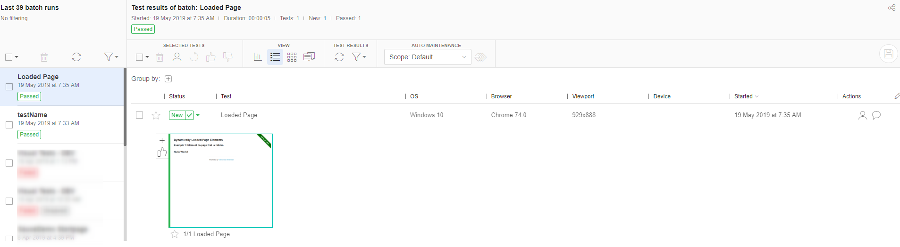

# Serenity BDD Boilerplate project

This is a Boilerplate project that automates various scenarios of the [Herokuapp](http://the-internet.herokuapp.com/) by using Serenity BDD. 
## Getting Started

These instructions will get you a copy of the project up and running on your local machine for development and testing purposes.

### Prerequisites

* Java JDK 8 
* Maven needs to be installed.  


### Installing

Clone repository 

```
git clone https://github.com/Anonymvs17/uiautomation.git
```

Download latest Chromedriver at: http://chromedriver.chromium.org/downloads and copy it in the following directory: 
```
uiautomation/drivers
```
Make sure that the path to your chromedriver is correct in the `serenity.properties` in following property:
```
webdriver.chrome.driver=drivers/chromedriver.exe
```

## Running the tests

To run all test just simply execute
```
mvn clean compile tests
```

## Structure
To enhance maintenance and reduce complexity this projects is divided into three main sections. 
Namely, Page objects, Steps and Tests which will be further explained in this section.
  
### Page Objects
The Page Object Model is a pretty popular pattern which enhances the project's maintenance by reducing code duplication.
That said, with the POM page objects that are object-oriented classes are created that serves as an interface for your corresponding webpages.

Page objects are located in the _ui.pages_ directory for example the _DynamicLoadingOverviewPage.java_ represents following page in the [Herokuapp](http://the-internet.herokuapp.com/dynamic_loading).
```java
@DefaultUrl("/dynamic_loading")
public class DynamicLoadingOverviewPage extends PageObject {

    @FindBy(css = "h3")
    private WebElementFacade headline;

    @FindBy(css = "[href=\"/dynamic_loading/1\"]", timeoutInSeconds = "10")
    private WebElementFacade  firstLink;

    public WebElementFacade getHeadline() {
        return headline;
    }

    public WebElementFacade getFirstLink() {
        return firstLink;
    }
}
``` 
The responsibly of a Page Object is simply to provide WebElements for the Test Steps. So you could say it fulfills the Single Responsibility Principle.

### Steps
Steps are using the WebElements of Page Objects to perform some actions (like click, getText, etc.) or even verifications.

Steps are located in _ui.steps_ directory. 

```java
public class DynamicLoadingPageSteps extends ScenarioSteps {

    private DynamicLoadingOverviewPage dynamicLoadingPage;

    @Step("Navigate to dynamic loading element page")
    public DynamicLoadingPageSteps openDynamicLoadingElementsPage() {
        dynamicLoadingPage.open();
        return this;
    }

    @Step("Click on first link")
    public DynamicLoadingPageSteps clickOnFirstLink() {
        dynamicLoadingPage
                .getFirstLink()
                .click();
        return this;
    }
}
``` 
As you see in the example, the _DynamicLoadingPageSteps.java_ is using the _DynamicLoadingOverviewPage_ (Page Object) to perform some actions.
 
### Tests
Tests are using combining test steps to verify some scenario by also using specific test data.

Tests are located in the _ui.features_ directory. 

As an example: The test DynamicLoadingPageTest.java is just communicating with the test steps, so not Pages should be on this level.
Further, test data is created at this level and test steps are combined to form a business scenario.
```java
public class DynamicLoadingPageTest extends AbstractTest {

    private String searchText;

    @Steps
    private DynamicLoadingPageSteps dynamicLoadingPageSteps;

    @Before
    public void setUp() {
        searchText = getTestData().getProperty("testdata.searchterm");
    }

    @Test
    @WithTag(name = "DynamicLoading")
    public void dynamicPageLoading() {
        dynamicLoadingPageSteps
                .openDynamicLoadingElementsPage()
                .checkThatHeadlineContainsText("Dynamically Loaded Page Elements")
                .clickOnFirstLink()
                .clickOnStartButton()
                .waitForLoadingElementAndVerifyText("Hello World!");
    }
}
```

## Data management
### run tests with different properties
You can use different serenity property files. 
By default serenity.properties will be selected, 
but you can start your test with a different property file.

Run with maven following command to run your test with with serenity-dev.properties

`clean compile test -Dproperties=serenity-dev.properties`

In this case you can override test data for different environments, or also configure different browsers.

## Image comparison
You can use the ApplitoolsSevice.java (but you do not need to) to do image comparison of your webpages. But in order to be able do that a registration at Applitools is needed.
Once registered you will receive an Key from Applitools. Copy paste the key in the property _applitools.key_ of _serenity.properties_. 
```
applitools.key=addYourKeyHere
```

Once this is done you can use the AppliToolsService as illustrated in this test: 
```java
public class DynamicLoadingPageTest extends AbstractTest {

    private String searchText;

    @Steps
    private DynamicLoadingPageSteps dynamicLoadingPageSteps;

    //1. Declare the ImageComparisonService here
    private ImageComparisonService imageComparisonService;

    @Before
    public void setUp() {
        searchText = getTestData().getProperty("testdata.searchterm");
    }

    @Test
    @WithTag(name = "DynamicLoading")
    public void dynamicPageLoading() {
        dynamicLoadingPageSteps
                .openDynamicLoadingElementsPage()
                .checkThatHeadlineContainsText("Dynamically Loaded Page Elements")
                .clickOnFirstLink()
                .clickOnStartButton()
                .waitForLoadingElementAndVerifyText("Hello World!");
        WebDriver driver = ((WebDriverFacade) ThucydidesWebDriverSupport.getDriver()).getProxiedDriver();

        //2. Initialize ApplitoolsService here
        imageComparisonService = new ApplitoolsService(driver, getTestData().getProperty("applitools.key"));
        //3. Run the test
        imageComparisonService.record("Loaded Page");
    }
}
```

Once you run this test, an image comparison will be executed by Applitools on the last visited page in the test. 



## License

This project is licensed under the MIT License - see the [LICENSE.md](LICENSE.md) file for details

